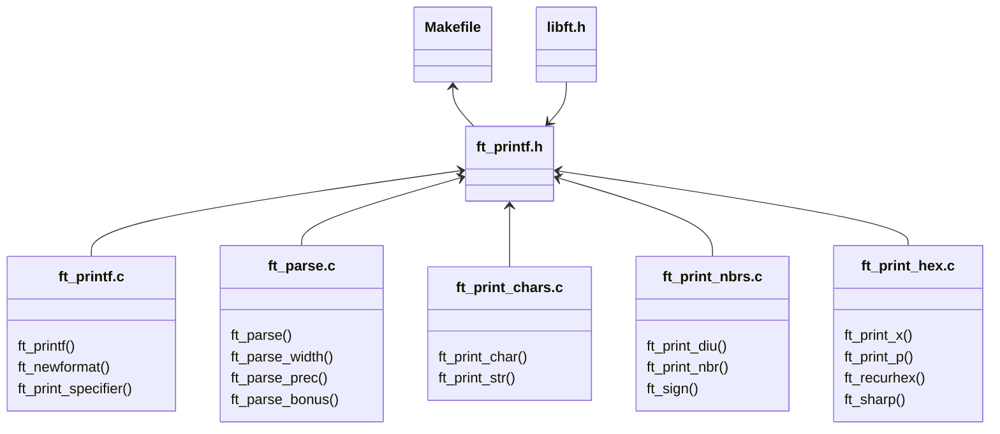
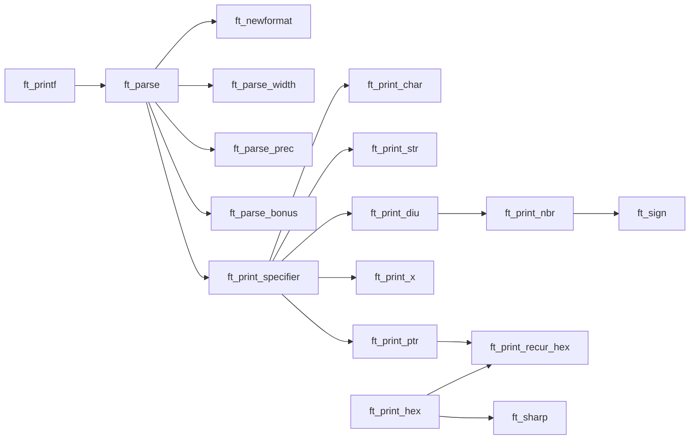

<a name="readme-top"></a>
<div align="center">

# ft_printf

( a [42 School](https://github.com/42School) Project )

<p>
    
    
    
    
    
</p>

___

<h3>Table o'Contents</h3>


<!-- mtoc-start -->

* [About :pushpin:](#about-pushpin)
* [Usage :checkered_flag:](#usage-checkered_flag)
* [Implementation :scroll:](#implementation-scroll)
* [Constrains ](#constrains-)
* [Mandatory Requirements:exclamation:](#mandatory-requirementsexclamation)
* [Bonus Requirements :money_mouth_face:](#bonus-requirements-money_mouth_face)
* [Structure :construction:](#structure-construction)
  * [Mandatory Files & Folder Structure](#mandatory-files--folder-structure)
  * [Mandatory Processing Flow](#mandatory-processing-flow)
  * [Bonus Structure:exclamation:](#bonus-structureexclamation)
    * [Bonus Files & Folder Structure](#bonus-files--folder-structure)
  * [Bonus Processing Flow](#bonus-processing-flow)
  * [License :copyright:](#license-copyright)

<!-- mtoc-end -->

<div/>

___

<div align="left">

# About :pushpin:

</div>

<div align=center>

> Because `ft_putnbr()` and `ft_putstr()` aren't enough!

This project is an exploration into how `printf()` works. The objective is to write a library that mimics the behaviour of `printf()`. A re-code challenge with the aim of revealing how `variadic functions` work in C. This project is an exercise on how to build a well-planned, well-structured extensible code base.

[ft_printf (Subject English)](/ft_printf.en.subject.pdf)

___

<div align="left">

# Usage :checkered_flag:

1. Clone the repo:
```shell
git clone git@github.com:PedroZappa/42_ft_printf.git 
```

2. Initialize local submodules configuration:
```shell
git submodule init
```

3. Update submodules:
```shell
git submodule update --recursive --remote
```

4. Build the project:
```shell
make bonus
```


</div>

____

<div align="left">

# Implementation :scroll:

In this project `printf()` is implemented with the following prototype:

```c
void	ft_printf(const char *format, ...);
```

## Constrains 

- To accomplish this, the implementation is limited to the use of [libft](https://github.com/PedroZappa/libft) (which makes its performance slower than the standard `printf()`) and a restricted set of standard functions.

    > For **memory allocation** and **deallocation**: `malloc()` and `free()`; 
    >
    > To **write** into the allocated memory: `write()`;
    >
    > To support **variadic functionality**: `va_start()`, `va_arg()`, `va_copy()`, `va_end()`;

- `ft_printf()` doesn't handle overflows and unexpected inputs the same way the real `printf()` would.

## Mandatory Requirements :exclamation:

- Do NOT implement the buffer management of the original `printf()`;
- The function has to handle the following conversions (format specifiers):

    | Format | Meaning |
    |--------|---------|
    | `%c` | Prints a single `char`;
    | `%s` | Prints a string of characters (`char *`);
    | `%p` | Prints a Pointer Address in hexadecimal (`void *`);
    | `%d` | Prints a decimal (base 10) number;
    | `%i` | Prints an integer in base 10;
    | `%u` | Prints an unsigned decimal (base 10) number;
    | `%x` | Prints a number in hexadecimal (base 16) lowercase format;
    | `%X` | Prints a number in hexadecimal (base 16) uppercase format;
    | `%%` | Prints a `%` character;

- Format specifiers obey the following prototype:

    ```c
    %[flags][width][.precision]specifier
    ```

- The function must behave like `printf()`;

- The library has to be built using the command `ar`;

## Structure :construction:

#### Mandatory Files & Folder Structure

`ft_printf()`s mandatory code base has the following file structure:



### Mandatory Processing Flow

The subprocesses of `ft_printf` mandatory implementation are called in the following order:



___

### License :copyright:

This work is published under the terms of <a href="https://github.com/PedroZappa/ft_printf/blob/master/LICENSE">42 Unlicense</a>.

<p align="right">(<a href="#readme-top">get to top</a>)</p>
