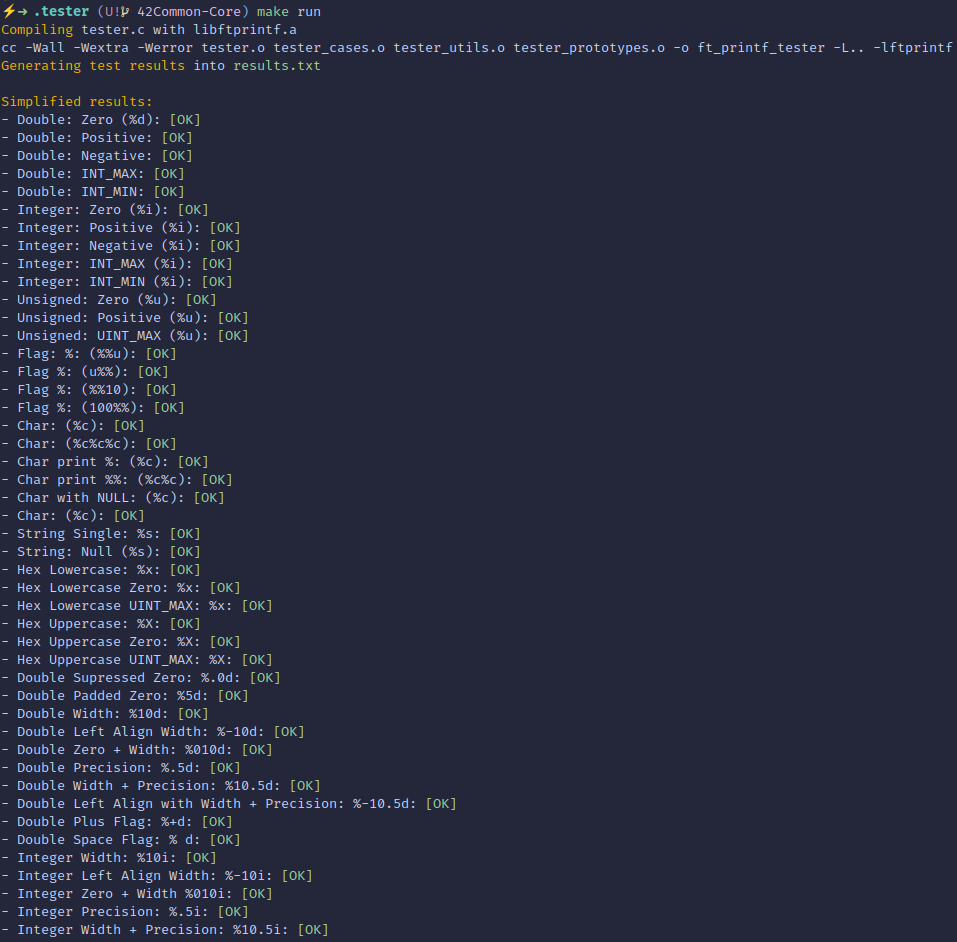
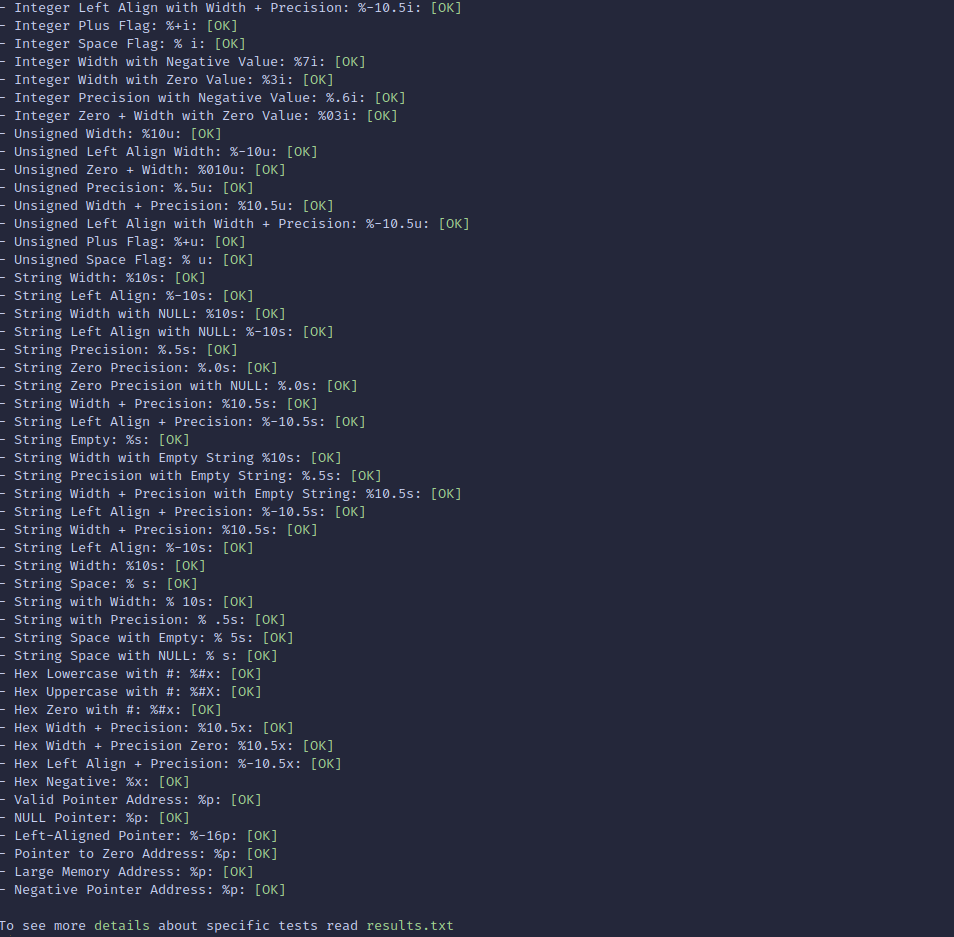
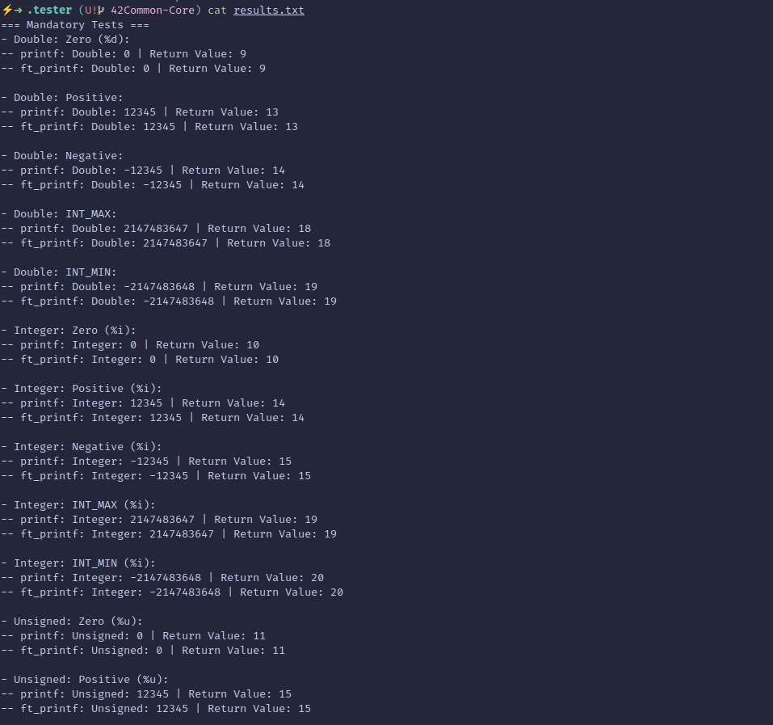

<h1 align="center">ft_printf</h1>

A reimplementation of the standard `printf`, engineered with full bonus flag coverage and supported by an autonomous regression tester tailored to 42 evaluations.

<h2 align="center">Index</h2>
<h3 align="center"><b>
    <a href="#About">About ft_printf</a>
    <span> • </span>
    <a href="#Tester">Custom Tester</a>
    <span> • </span>
    <a href="#Subject">Subject Compliance</a>
    <span> • </span>
    <a href="#Layout">Repository Layout</a>
    <span> • </span>
    <a href="#Build">Build &amp; Integration</a>
    <span> • </span>
    <a href="#Usage">Usage Guidelines</a>
    <span> • </span>
    <a href="#Conversions">Conversion Reference</a>
    <span> • </span>
    <a href="#Flags">Flag Handling</a>
    <span> • </span>
    <a href="#Architecture">Internal Architecture</a>
    <span> • </span>
    <a href="#Workflow">Tester Workflow</a>
    <span> • </span>
    <a href="#Results">Results &amp; Reporting</a>
    <span> • </span>
    <a href="#Related">Related Projects</a>
    <span> • </span>
</b></h3>

## <a id="About"></a>About ft_printf
- Recreates the libc `printf` contract for `cspdiuxX%`, including precise return values and edge-case handling for `NULL` pointers and suppressed precision.
- Ships with mandatory and bonus builds, both driven by `t_parser`/`t_padding` state structs to keep flag logic self-contained and easy to audit.
- Prints identical output to the system `printf` while respecting the 42 Norm, memory safety rules, and the subject's prohibition on manual buffer management.

## <a id="Tester"></a>Custom Tester
- `.tester` houses a dedicated harness (`ft_printf_tester`) built with the freshly archived `libftprintf.a`, so every run targets the latest implementation.
- `make run` wipes stale artefacts, rebuilds with `-Wall -Wextra -Werror`, and executes the binary while `tester.c` diverts stdout to `results.txt` for a full transcript.
- Each `run_test_*` helper prints a banner, renders the baseline through `vprintf`, then replays the same varargs through specifier-aware wrappers (`handle_numbers`, `handle_string`, `handle_hex`, etc.) to log `ft_printf` output and return values side by side.
- After the run, stdout returns to the terminal and an embedded `awk` script cross-checks every pair of lines, tagging `[OK]/[KO]` so discrepancies are immediately visible.
- Coverage spans mandatory and bonus specifiers, flag combinations, boundary integers, precision edge cases, and null inputs to surface regressions before defence or peer reviews.

<table>
  <tr>
    <td width="33%" align="center"></td>
    <td width="33%" align="center"></td>
    <td width="33%" align="center"></td>
  </tr>
</table>
<p align="center"><em>Running tester & showcasing results at a glance</em></p>

## <a id="Subject"></a>Subject Compliance
- Targets the official specification bundled as `docs/subject_printf.pdf` and produces the required `libftprintf.a` static archive at repository root.
- Makefile honours mandatory rules (`all`, `bonus`, `clean`, `fclean`, `re`) and never performs redundant relinking.
- Bonus sources follow the `_bonus.c/_bonus.h` naming scheme, ensuring the evaluator can build mandatory and bonus parts independently.
- Uses only authorised libc functions (`malloc`, `free`, `write`, `va_*`) and avoids the forbidden buffering that the subject explicitly disallows.

## <a id="Layout"></a>Repository Layout
| Path | Description |
| --- | --- |
| `src/` | Mandatory implementation: parser, padding helpers, and conversion handlers declared in `src/ft_printf.h`. |
| `srcb/` | Bonus implementation mirroring the mandatory API with extended flag coverage. |
| `.tester/` | Autonomous C tester with its own Makefile, harness sources, and generated `results.txt`. |
| `obj/` / `objb/` | Object directories created on demand by the Makefile (ignored by git). |
| `docs/subject_printf.pdf` | Official 42 subject for quick reference during reviews. |
| `docs/images/` | Visual assets used throughout this README. |
| `Makefile` | Builds either mandatory or bonus artefacts and wires the library into the tester. |
| `README.md` | Project overview, tester documentation, and usage guide. |

## <a id="Build"></a>Build &amp; Integration
```bash
# Build mandatory ft_printf
make

# Build the bonus variant
make bonus

# Clean intermediates / full rebuild
make clean
make fclean
make re
```
- Outputs `libftprintf.a` and the corresponding `obj/` (or `objb/`) directories, ready to be linked into any other project.
- The Makefile reuses compiled objects when possible, keeping iterative builds fast during development and testing.

## <a id="Usage"></a>Usage Guidelines
- Include the public header in client code: `#include "ft_printf.h"` (or the bonus header if you integrate that variant).
- Link the static archive alongside your sources, e.g. `cc main.c -L path/to/42_printf -lftprintf`.
- When embedding in larger 42 projects, copy the sources or archive into your `libft` folder and adjust your parent Makefile accordingly.
- The library returns the exact number of characters written, matching the behaviour expected by the Moulinette and peer evaluators.

## <a id="Conversions"></a>Conversion Reference
| Conversion | Description | Notes |
| --- | --- | --- |
| `%c` | Prints a single character | Width and `-` flags handled via padding helpers. |
| `%s` | Prints a null-terminated string | Precision gracefully truncates; `NULL` becomes `(null)` unless suppressed. |
| `%p` | Prints a pointer in hexadecimal | Emits `(nil)` for null pointers, otherwise `0x` prefixed lowercase hex. |
| `%d` / `%i` | Signed decimal integer | Supports sign, space, zero, width, and precision interactions. |
| `%u` | Unsigned decimal integer | Ignores sign/space flags per specification while keeping width/precision behaviour. |
| `%x` / `%X` | Unsigned hexadecimal | Honors `#` for prefixes, precision suppression, and casing rules. |
| `%%` | Literal percent sign | Bypasses flag parsing and writes a single `%`. |

## <a id="Flags"></a>Flag Handling
- Width and precision are parsed numerically and stored in `t_parser`, allowing combined scenarios such as `%10.5d` or `%-08.4x` to render correctly.
- The `0` flag converts to zero-padding only when precision is not specified and left alignment is disabled, mirroring glibc behaviour.
- `+` and space flags are mutually exclusive and only apply to signed conversions; `%u`, `%x`, and `%X` automatically clear them during parsing.
- `#` prepends `0x`/`0X` for non-zero hex values, with the padding logic expanding to account for the extra characters.
- Pointer formatting delegates to the string padding helpers so that width/precision from the subject's bonus requirements are consistently enforced.

## <a id="Architecture"></a>Internal Architecture
- Parsing is centralised in `ft_parser`, which walks the format string once, toggling flags and recording width/precision before dispatching to the right handler.
- `t_padding` captures the amount of leading zeros and surrounding spaces so each printer can focus on content rather than spacing edge cases.
- Numeric conversions share the `ft_calc_numeric_pad` utility, which applies precision, zero-padding, hash prefixes, and sign logic in a single pass.
- String conversions reuse the same infrastructure (`ft_calc_string_pad`, `ft_handle_str`) to keep null-handling and precision truncation identical across `%s` and `%p`.
- The helper layer (`ft_itoa_pf`, `ft_utoa_pf`, `ft_itoa_base_pf`, `ft_strjoin_pf`) mirrors libc behaviour while remaining Norm-compatible and leak-free.

## <a id="Workflow"></a>Tester Workflow
- `tester.c` redirects stdout to `results.txt`, runs mandatory and bonus suites sequentially, then restores the terminal stream.
- `tester_cases.c` enumerates exhaustive scenarios for each specifier, capturing boundaries such as `INT_MIN`, `UINT_MAX`, mixed flag combinations, and null inputs.
- Each `run_test_*` helper in `tester_prototypes.c` performs a two-step comparison: first `vprintf` renders the baseline, then specialised handlers forward the same varargs to `ft_printf` so both output and return values can be reviewed.
- `tester_utils.c` supplies the plumbing—redirect helpers, targeted argument serializers for `%c`, `%s`, `%p`, and `%x/%X`, plus utility logic for precision truncation—ensuring every edge case is exercised without manual intervention.
- The tester Makefile drives the process and ensures a clean slate by deleting stale objects and prior logs before every execution.

## <a id="Results"></a>Results &amp; Reporting
- `make run` prints an immediate summary to the terminal while the full detail lives in `.tester/results.txt`, including side-by-side outputs and their respective return values.
- The log keeps tests grouped under descriptive headers (mandatory, bonus, per-specifier) to simplify debugging when a regression appears.
- For deeper inspection, open `results.txt` in any editor or pipe it through additional tooling—its structure (test banner + printf output + ft_printf output) is stable by design.
- An extra reference capture lives at `docs/images/results_example.png` for a quick visual of the produced report.

## <a id="Related"></a>Related Projects
- Crafted to drop into a personal `libft`, enabling seamless reuse across other 42 milestones such as `get_next_line` or future C Piscine projects.
- Tested against the same scenarios the school evaluation scripts expect, easing integration with custom tooling or CI setups you may build later.
